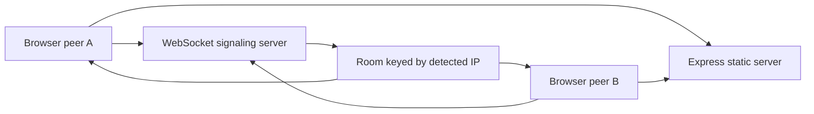

# Architecture

## 1. Project type

This project is a small full-stack Node.js web app with:

- an Express static file server
- a WebSocket signaling server
- a browser client served from `public/`

## 2. System boundary

This project is responsible for:

- serving the Snapdrop web client
- assigning browser peers stable cookie-based peer IDs
- grouping peers by detected IP address
- relaying WebSocket signaling messages between peers in the same room
- applying a basic HTTP rate limit

This project is not responsible for:

- storing uploaded files
- managing user accounts or authentication
- persisting peer history
- providing a database schema
- deploying itself to production

## 3. Main entry points

| Entry | Purpose |
|---|---|
| `index.js` | Starts the HTTP server, static file serving, rate limiting, and WebSocket signaling. |
| `public/index.html` | Main browser UI document. |
| `public/scripts/network.js` | Browser-side peer networking and signaling flow. |
| `public/scripts/ui.js` | Browser-side UI interactions. |
| `public/service-worker.js` | Offline/cache behavior for the web client. |
| `scripts/check-architecture.js` | Repository hygiene checks. |
| `scripts/check-syntax.js` | JavaScript syntax check. |
| `scripts/smoke-test.js` | Starts the app and verifies `GET /`. |

## 4. Data flow

## 5. Module boundaries

| Module | Responsibility | Should not do |
|---|---|---|
| `index.js` | Server startup, rate limiting, peer rooms, WebSocket message relay. | Persist user data or embed client UI logic. |
| `public/` | Browser assets and client behavior. | Read server internals directly. |
| `scripts/` | Local validation and maintenance checks. | Change product behavior at runtime. |
| `.github/workflows/` | Remote validation. | Deploy or publish without an explicit workflow. |

## 6. Configuration

| Config | Source | Required | Description |
|---|---|---|---|
| `PORT` | environment | no | Server port. Defaults to `3000`. |
| `NODE_ENV` | environment | no | Conventional Node environment value. |
| `public` argument | CLI | no | Runs the server with Node's default listen host behavior. |

## 7. External dependencies

| Dependency | Purpose | Replaceable? |
|---|---|---|
| `express` | HTTP server and static file serving. | Yes, with a server rewrite. |
| `express-rate-limit` | Basic HTTP rate limiting. | Yes. |
| `ws` | WebSocket server. | Yes, with signaling changes. |
| `ua-parser-js` | Browser/device display metadata. | Yes. |
| `unique-names-generator` | Human-readable peer display names. | Yes. |

## 8. Testing strategy

| Test type | Location | Command |
|---|---|---|
| syntax | `scripts/check-syntax.js` | `pnpm run lint` |
| architecture | `scripts/check-architecture.js` | `pnpm run arch:check` |
| smoke | `scripts/smoke-test.js` | `pnpm test` |
| all | package scripts | `pnpm check` |

## 9. Non-goals

This project intentionally does not include:

- a database
- user login
- production deployment automation
- large frontend build tooling
- telemetry or analytics

## 10. Future extension points

Possible future work:

- add focused unit tests around peer room behavior
- split server classes into modules if `index.js` grows
- add browser end-to-end tests for peer discovery
- document reverse proxy settings for public deployments
